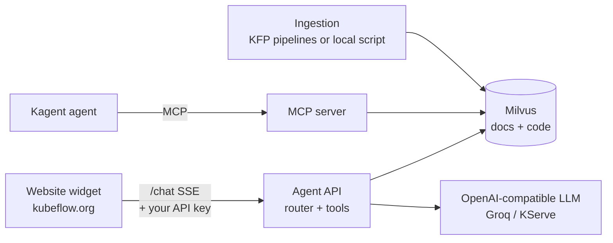

# Kubeflow Docs Agent: agentic RAG for Kubeflow

An AI assistant that answers Kubeflow questions from two sources, with citations:

- the **official documentation** (kubeflow.org/docs)
- the **deployment manifests and code** in [kubeflow/manifests](https://github.com/kubeflow/manifests)

A router decides per question whether to search the docs, the code, or both. The answer is
generated by any OpenAI-compatible LLM using tool calls against Milvus. The assistant ships as a
chat widget for the Kubeflow website and as MCP tools for a managed [Kagent](https://kagent.dev) agent.



**Features**

- **Two-source retrieval:** heading-aware docs chunks, and AST/YAML-aware code chunks with GitHub
  line-anchored citations
- **Routing:** each question goes to `docs`, `code` or `hybrid`, with candidate over-fetch and
  heuristic reranking
- **Tool calling:** exactly two LLM calls per answer (choose tools, then answer), streamed over SSE,
  with multi-turn threads
- **Bring your own key:** visitors can paste their own LLM key in the widget. It is kept only for
  that browser tab and can be cleared with one click.
- **Runs anywhere:** a laptop (CPU + Docker), GKE, or fully in-cluster with KServe
- **Same ingestion everywhere:** the code runs as Kubeflow Pipelines or as a local script

See **[docs/ARCHITECTURE.md](docs/ARCHITECTURE.md)** for the full system design.

---

## Quick start (local, no cloud)

**You need:** Docker (about 4 GB free RAM for Milvus), [uv](https://docs.astral.sh/uv/), and an
API key for an OpenAI-compatible LLM that supports tool calling. A free
[Groq](https://console.groq.com/keys) key works. Tested on an Apple M1 (CPU only).

```bash
git clone https://github.com/himanshu1573/Kube-Flow_doc_agent_rag.git
cd Kube-Flow_doc_agent_rag

make setup          # .venv with Python 3.12 + deps; creates .env from .env.example
$EDITOR .env        # set LLM_API_KEY (or leave it empty and paste a key in the widget instead)

make milvus-up      # Milvus standalone in Docker (data in ./volumes)
make ingest         # docs: 20 pages (~2 min); code: kubeflow/manifests (~4 min)
make api            # agent API on http://localhost:8000
```

In a second terminal:

```bash
make web            # http://127.0.0.1:8090/website/preview.html  (website widget)
                    # http://127.0.0.1:8090/demo/agent-section-demo.html  (demo page)
```

Or call the API directly:

```bash
curl -s localhost:8000/chat -H 'Content-Type: application/json' \
  -d '{"message": "What is Kubeflow Pipelines?", "stream": false}'

# with your own key instead of the server's
curl -s localhost:8000/chat -H 'Content-Type: application/json' \
  -H 'X-LLM-API-Key: <your key>' \
  -d '{"message": "How do I configure the notebook mutating webhook YAML?", "stream": false}'
```

Stop everything with `Ctrl+C` and `make milvus-down`. Run `make help` to list all targets.

> **Free-tier LLMs:** Groq's free tier allows about 8k tokens per minute. One answer uses about
> 4–8k tokens, so wait a little between questions. `.env.example` already sets small
> `LLM_MAX_TOKENS` / `LLM_FOLLOWUP_MAX_TOKENS` values, and the API retries 429s using `Retry-After`.

## Use your own API key

Open the widget, click the **key icon** in the header, paste a key for the provider it names (for
example `api.groq.com`), and click **Save key**.

- The key is stored in your browser's **sessionStorage**. It is cleared when the tab closes, or
  immediately with **Clear key**.
- It is sent only to the agent API, as the `X-LLM-API-Key` header, and used for your requests only.
  The server never logs or stores it.
- Operators of public deployments set `REQUIRE_CLIENT_API_KEY=true`. Visitors then must bring a key,
  and the server's own key is never spent.

## Configuration

All settings are environment variables (see [.env.example](.env.example)).

| Variable | Default | Purpose |
|---|---|---|
| `KSERVE_URL` | in-cluster KServe URL | OpenAI-compatible `/chat/completions` endpoint (fixed by the server) |
| `MODEL` | `llama3.1-8B` | Default model name (clients may override with `X-LLM-Model`) |
| `LLM_API_KEY` | empty | Server key. Optional when clients bring keys or the endpoint needs none. |
| `LLM_MAX_TOKENS` / `LLM_FOLLOWUP_MAX_TOKENS` | `1500` / `1000` | Output budgets for the tool-selection and answer calls |
| `LLM_RATE_LIMIT_RETRIES` / `LLM_MAX_RETRY_WAIT` | `2` / `10` | 429 retries and maximum wait per retry in seconds |
| `ALLOW_CLIENT_API_KEYS` | `true` | Accept `X-LLM-API-Key` / `X-LLM-Model` from clients |
| `REQUIRE_CLIENT_API_KEY` | `false` | Reject requests without a client key (401) |
| `EMBEDDING_MODEL` | `BAAI/bge-base-en-v1.5` | **Must match between ingestion and the API**. `.env.example` uses MiniLM (384-d), which is faster on CPU. |
| `MILVUS_HOST` / `MILVUS_PORT` | `localhost` / `19530` | Vector DB |
| `DOCS_COLLECTION` / `CODE_COLLECTION` | `docs_collection` / `code_collection` | Collection names |
| `THREAD_TTL_SECONDS` / `THREAD_MAX_MESSAGES` | `3600` / `16` | In-memory conversation window |

## API

| Endpoint | Description |
|---|---|
| `POST /chat` | Body: `{message, stream=true, thread_id?, reset_thread?, context?: {title, path, url}}`. Optional headers: `X-LLM-API-Key`, `X-LLM-Model`. With `stream=true` it returns SSE events `thread`, `tool_result`, `content`, `citations`, `error`, `done`. With `stream=false` it returns `{thread_id, route, response, citations}`. Errors: 400 malformed headers, 401 key missing or rejected, 429 rate limited, 502 other LLM errors. |
| `GET /config` | `{model, llm_provider_host, allow_client_api_keys, require_client_api_key, server_api_key_configured}` |
| `GET /health` | Liveness and readiness probe |

## Repository layout

```
agent/core/            router, retriever (Milvus + rerank + tools), thread state   ← shared runtime
server-https/          FastAPI agent API (/chat SSE + JSON, /config)              ← main entrypoint
server/                WebSocket variant of the API (upstream interface)
kagent-feast-mcp/      MCP server exposing the retrieval tools; Kagent manifests
pipelines/
  docs_ingestion/      crawler → section chunker → embedder → Milvus loader (+ KFP pipeline)
  code_ingestion/      repo cloner → AST/YAML parser → chunker → embedder → loader (+ KFP)
  shared/              embeddings, Milvus helpers, query analysis + reranking
backend/schemas/       Milvus collection schemas (HNSW, COSINE)
website/               chat widget + Hugo partial for kubeflow/website, website image + GKE
demo/, docs_scripts/   standalone demo page and its widget
agent/kserve/          KServe LLM blueprints + GKE API deployment
deploy/live/           Architecture B (Kagent + MCP) and HTTPS ingress manifests
deploy/local/, docker-compose.yml, Makefile, scripts/   local stack
tests/                 unit tests (no Milvus or LLM needed)
docs/                  ARCHITECTURE.md, deploy-gke.md, website checklist, notes
```

## Deploy

| Target | Guide |
|---|---|
| GKE prototype (Milvus + API + HTTPS + MCP) | [docs/deploy-gke.md](docs/deploy-gke.md) |
| Kagent managed agent over MCP (Architecture B) | [deploy/live/README.md](deploy/live/README.md) |
| In-cluster LLM with KServe | [agent/kserve/README.md](agent/kserve/README.md) |
| Kubeflow website widget | [website/README.md](website/README.md) |
| Ingestion as Kubeflow Pipelines | `make compile-pipelines`, then upload `pipelines/*/pipeline.yaml` ([pipelines/README.md](pipelines/README.md)) |

## Tests

```bash
make test
```

The 25 unit tests cover chunk records and URL handling, the malformed-sitemap fix, docs/code/hybrid
routing, citations, thread state, the single tool round-trip, 429 retry and status mapping, and the
bring-your-own-key policy. They run against a mocked LLM endpoint, with no Milvus needed.

## Troubleshooting

| Symptom | Cause / fix |
|---|---|
| `LLM service error: HTTP 404` | The model was retired by the provider. Pick a current one (Groq: `curl https://api.groq.com/openai/v1/models -H "Authorization: Bearer $KEY"`) and set `MODEL`. |
| `HTTP 429 (rate limit reached)` | Provider per-minute token limit. Wait, lower `LLM_*_MAX_TOKENS`, or use your own key or a paid tier. The API log shows the provider's exact message. |
| `HTTP 401 (the LLM provider rejected the API key)` | Wrong key for the configured provider. Check `GET /config` → `llm_provider_host`. |
| Milvus search errors about vector dimension | Ingestion and API use different `EMBEDDING_MODEL`s. Re-ingest with `scripts/ingest_local.py all --recreate`. |
| No answers or empty context | Collections are empty. Run `make ingest`, and check that Milvus is healthy at `curl localhost:9091/healthz`. |

## Credits

This project builds on **[kubeflow/docs-agent](https://github.com/kubeflow/docs-agent)**
(Apache-2.0) and its contributors. The upstream base provides the original docs RAG servers, the
Kagent + Feast MCP proof of concept, the GitHub-docs KFP pipelines and the original chatbot widget.
The upstream README is kept at [docs/upstream-README.md](docs/upstream-README.md).

Built in this repository on top of that base, as part of GSoC 2026 work on agentic RAG for Kubeflow:

- AST-based code ingestion for kubeflow/manifests, and the docs crawler and section-aware chunking
  pipeline
- the router, shared retriever with reranking and code citations, and thread state
- the tool-calling agent API, MCP integration and Kagent (Architecture B) manifests
- GKE deployment with a public HTTPS API, the Kubeflow website widget, and bring-your-own-key support
- the local Compose/make workflow, tests and docs

## License

Apache License 2.0. See [LICENSE](LICENSE).
