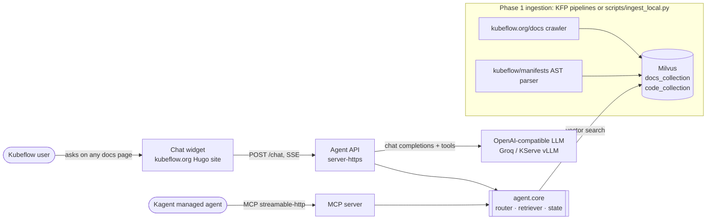
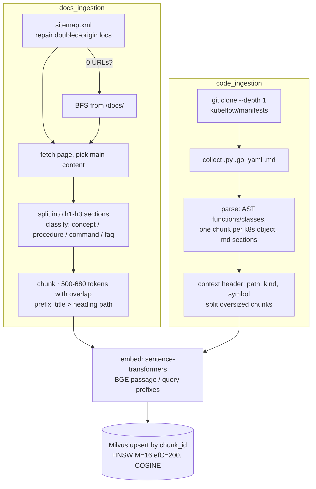
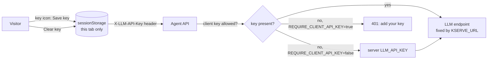

# System design

The Kubeflow Docs Agent is an agentic RAG assistant for Kubeflow users. It answers questions
from two sources:

- the official **documentation** at kubeflow.org/docs
- the **manifests and code** in [kubeflow/manifests](https://github.com/kubeflow/manifests)

Every answer cites its sources. The assistant is embedded in the Kubeflow website as a chat
widget, and is also available as MCP tools for a managed Kagent agent.

## 1. Goals and non-goals

| Goals | Non-goals (for now) |
|---|---|
| Grounded answers with citations (docs URLs, GitHub line anchors) | Fine-tuning or hosting our own model by default |
| Route each question to docs, code, or both | Auth, quotas, multi-tenant isolation |
| Ingestion that runs as Kubeflow Pipelines *and* locally | Persistent or shared chat history |
| One retrieval core reused by the HTTP API, the WebSocket server and the MCP server | Full observability stack |
| Runs fully on a laptop (CPU, Docker) and on GKE | |

## 2. Context



## 3. Components

| Component | Path | Responsibility |
|---|---|---|
| Docs ingestion | `pipelines/docs_ingestion/` | Discover docs URLs (sitemap, then BFS fallback), extract heading-aware sections, chunk, embed, upsert |
| Code ingestion | `pipelines/code_ingestion/` | Shallow-clone a repo, parse Python/Go (AST), YAML (per k8s object) and Markdown into symbol chunks, embed, upsert |
| Shared utils | `pipelines/shared/` | Embedding client (BGE/E5 query prefixes), Milvus helpers, query analysis + reranking |
| Schemas | `backend/schemas/` | Milvus field definitions and HNSW/COSINE index params for both collections |
| Router | `agent/core/router.py` | Rule-based `docs` / `code` / `hybrid` classification; builds the route-aware system prompt |
| Retriever | `agent/core/retriever.py` | Searches the collections, over-fetches and reranks, formats hits, builds citations, defines and executes LLM tools |
| Thread state | `agent/core/state.py` | In-memory conversation threads (TTL, bounded history) |
| Agent API | `server-https/app.py` | FastAPI `/chat` (SSE or JSON): routing, tool-calling loop against the LLM, citations |
| WebSocket server | `server/app.py` | Same agent core over WebSockets (upstream interface) |
| MCP server | `kagent-feast-mcp/mcp-server/server.py` | Exposes `search_kubeflow_context`, `search_kubeflow_docs`, `search_kubeflow_code` over MCP |
| Website widget | `website/` | Vanilla JS widget + Hugo partial for kubeflow/website |
| Demo widget | `docs_scripts/`, `docs_styles/`, `demo/` | Standalone demo page that shows the router and tool events |
| Deployment | `agent/kserve/`, `deploy/live/`, `manifests/`, `docker-compose.yml` | GKE, KServe, Kagent and local manifests |

## 4. Ingestion (Phase 1)



- **Idempotent loads:** the primary key is a deterministic `chunk_id` (URL or path + heading or
  symbol + index), so re-runs upsert instead of duplicating. `--recreate`
  (`MILVUS_DROP_EXISTING[_DOCS]`) drops the collection. You need it after changing the embedding model.
- **Two runners, one code path:** `pipelines/*/pipeline.py` wraps the components as KFP
  components, and `scripts/ingest_local.py` calls the same functions in one process.

### Data model

| `docs_collection` | `code_collection` |
|---|---|
| `chunk_id` (PK), `source_url`, `page_title`, `heading`, `parent_heading`, `heading_path`, `breadcrumb_path`, `section`, `chunk_type`, `chunk_text`, `token_count`, `chunk_index`, `crawled_at`, `embedding` | `chunk_id` (PK), `file_path`, `extension`, `language`, `chunk_type`, `symbol_name`, `folder_context`, `chunk_text`, `start_line`, `end_line`, `commit_sha`, `chunk_index`, `embedding` |

The vector dimension follows `EMBEDDING_MODEL`: 384 for all-MiniLM-L6-v2, 768 for
bge-base-en-v1.5. **Ingestion and the API must use the same model.**

## 5. Query path (Phase 2)

```mermaid
sequenceDiagram
    participant W as Widget
    participant A as Agent API
    participant R as Router
    participant S as Thread store
    participant L as LLM
    participant M as Milvus
    W->>A: POST /chat {message, thread_id, context, stream} + optional X-LLM-API-Key / X-LLM-Model
    A->>A: resolve_llm_credentials: client key (if allowed) else server key; 401 if REQUIRE_CLIENT_API_KEY and none
    A->>R: classify_question(message + page title)
    R-->>A: route (docs|code|hybrid) + system prompt hint
    A->>S: ensure_thread / append user message
    A-->>W: SSE {type: thread, thread_id, route}
    A->>L: call 1: messages + route-scoped tools (max LLM_MAX_TOKENS)
    L-->>A: tool_calls [search_kubeflow_context, ...]
    loop each tool call
        A->>M: search (over-fetch 4×top_k) → rerank → top_k
        A-->>W: SSE {type: tool_result}
    end
    A->>L: call 2: all tool_calls + all tool results (max LLM_FOLLOWUP_MAX_TOKENS)
    L-->>A: streamed answer
    A-->>W: SSE {type: content} … {type: citations} {type: done}
    A->>S: append assistant answer
```

**Routing** (`classify_question`): `analyze_query` extracts the query type (definition, install,
how_to, compare, …) and signals such as `prefer_code`, `strongly_prefer_code`, `prefer_docs`,
`wants_code_examples` and `wants_steps`. Configuration words (yaml, manifest, webhook, rbac,
configmap, kustomize, helm) push the route towards code. If both kinds of signal appear, the route
is `hybrid`. If nothing matches, the default is also `hybrid`. The route decides two things:

1. which tools the LLM is offered. `search_kubeflow_context` is always offered; the docs tool, the
   code tool, or both are added by route.
2. a route hint plus answer-format guidance appended to the system prompt.

**Retrieval** (`search_context`): embeds the enhanced query, fetches `max(4×top_k, 12)`
candidates per collection, and reranks them. The rerank score is the vector score plus collection
preference, priority-term overlap, path-alias overlap and a lexical score. Then it keeps `top_k`.
Code citations are GitHub URLs with line anchors (`…/blob/master/<path>#L<start>`).

**LLM contract:** any OpenAI-compatible `/chat/completions` endpoint that supports streaming and
`tools`. The answer always takes exactly two LLM calls: one turn to choose tools, then one
follow-up with every tool result. If the model emits malformed tool JSON (`tool_use_failed`), the
API falls back to a direct retrieval call with the user's question.

**Errors:** an upstream 429 is retried up to `LLM_RATE_LIMIT_RETRIES` times (default 2). Each wait
honors `Retry-After`, capped by `LLM_MAX_RETRY_WAIT`. Non-streaming `/chat` returns 429 for rate
limits, 401 when the provider rejects the key, and 502 for other LLM errors. Streaming responses
send an `{type: "error", status}` event. The upstream status and error body are logged; keys are not.

### LLM credentials: bring your own key



- Anyone can use the assistant with their own key. The widget keeps it in `sessionStorage`, so it
  is gone when the tab closes, and **Clear key** removes it at once. It travels only as a request
  header to the agent API.
- The API uses the key for that request's LLM calls and nothing else. It is never logged, stored
  in thread state, or forwarded anywhere but the configured endpoint.
- The endpoint URL is server-controlled (`KSERVE_URL`). Clients can choose the key and model but
  not the URL, which prevents SSRF (the server being tricked into calling arbitrary URLs).
- `GET /config` tells the widget the provider host, default model and key policy.
  It never returns the key.

## 6. Deployment topologies

| Topology | What runs where | Use |
|---|---|---|
| **Local** | Milvus in Docker Compose; API and ingestion on the host (`make`); external LLM | Development, demos, interviews |
| **GKE prototype** (`docs/deploy-gke.md`) | GKE Autopilot: Milvus (Helm), agent API, HTTPS Ingress + ManagedCertificate, MCP server; LLM external (Groq) | Public demo backing the website widget |
| **Architecture B** (`deploy/live/`) | Adds Kagent: `ModelConfig` → Groq, `RemoteMCPServer` → MCP server, `Agent` | Managed agent using the same retrieval via MCP |
| **Fully in-cluster** (`agent/kserve/`) | KServe `InferenceService` (vLLM, `--tool-call-parser=llama3_json`) instead of an external LLM | GPU clusters; no data leaves the cluster |

## 7. Key decisions and trade-offs

| Decision | Why | Cost |
|---|---|---|
| Separate docs and code collections | Different schemas, chunking and citations; lets the router weight sources | Two searches for hybrid questions |
| Rule-based router instead of an LLM router | Deterministic, free, unit-testable, no extra LLM call | Misroutes unusual phrasings; the always-offered `search_kubeflow_context` tool mitigates this |
| Over-fetch + heuristic rerank | Improves precision without a cross-encoder model | Hand-tuned weights |
| External LLM (Groq) for the prototype | No GPUs, cheap, fast to stand up | Rate limits (free tier ≈ 8k tokens/min), model retirements, data leaves the cluster |
| Bring-your-own key per request | Public demo costs the operator nothing; each user gets their own rate limit | Users need a provider account; keys pass through the API, so serve it over HTTPS only |
| In-memory thread store | Zero dependencies | Lost on restart; not shared across replicas (run 1 replica or move to Redis) |
| One retrieval core for API, WebSocket and MCP | Consistent answers across interfaces | Core changes affect every interface |
| Widget config via Hugo param | Same build works locally, in previews and in production | Production still needs a public HTTPS API or a same-origin proxy |

## 8. Known limitations

- **CORS is `*`** and there is no auth or rate limiting on `/chat`. Restrict both before production.
  Serve the API over HTTPS only, because client keys travel in request headers.
- **The widget renders model output as Markdown with `marked` and no HTML sanitizer.** Add
  DOMPurify before exposing it publicly.
- **Thread state is in-memory**, as described in section 7.
- **The router and reranker are heuristic.** No retrieval-quality benchmark gates changes yet.
- **Free-tier LLMs:** set `LLM_MAX_TOKENS` / `LLM_FOLLOWUP_MAX_TOKENS` low, and expect occasional 429s.
